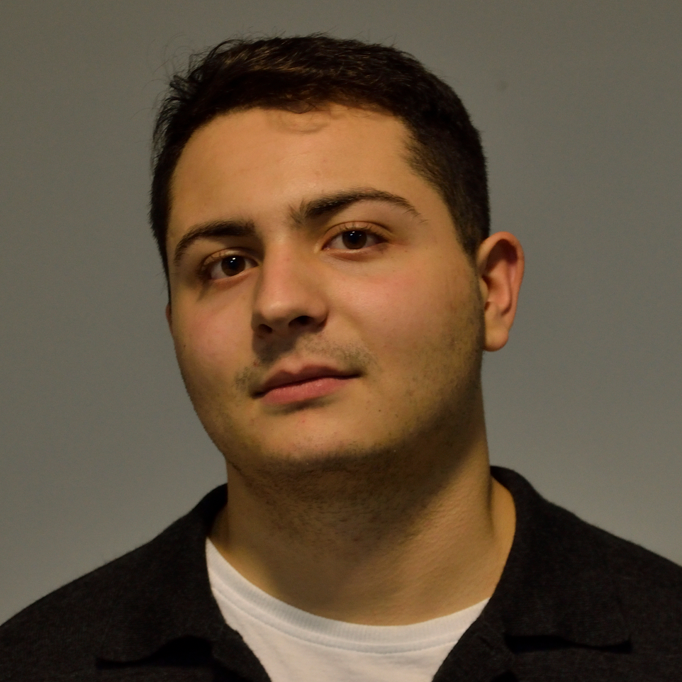

{:.profile}
{: style="float: left; margin: 35px"}

I am a first-year PhD student in the _Computer Science Department_ at _Cornell University_; extremely fortunate to be advised by Prof. [Jon Kleinberg](http://www.cs.cornell.edu/home/kleinber/). I received my undergraduate degree from the School of Electrical and Computer Engineering at the National Technical University of Athens in July 2020 where I completed my Thesis under the supervision of Prof. [Dimitris Fotakis](https://www.softlab.ntua.gr/~fotakis/) working on recommendation systems for very large social networks. I have also been a researcher for the [Business Analytics Lab (BALab)](https://www.balab.aueb.gr), supervised by Prof. [Diomidis Spinellis](https://www2.dmst.aueb.gr/dds/) working on applications of machine learning on software architecture recovery. 

My primary research interests lie within the field of _Data Science_ where I want to bridge theory and application in order to tackle many interesting problems. More specifically, I work on _information networks_, _statistical methods & models_ (MCMC methods, generative models for networks), and on issues regarding _fairness of networks_.    

My _research_ is accessible via the following _profiles_

 * [Google Scholar](https://scholar.google.gr/citations?user=T12JO3MAAAAJ&hl=en)
 * [GitHub](https://github.com/papachristoumarios)

A more detailed CV can be found [here](https://github.com/papachristoumarios/papachristoumarios.github.io/raw/master/cv/cv.pdf).

**Contact**

302 Gates Hall
Campus Rd, 
Ithaca, NY 14853

e-mail: papachristoumarios (at] cs [dot) cornell (dot] edu

