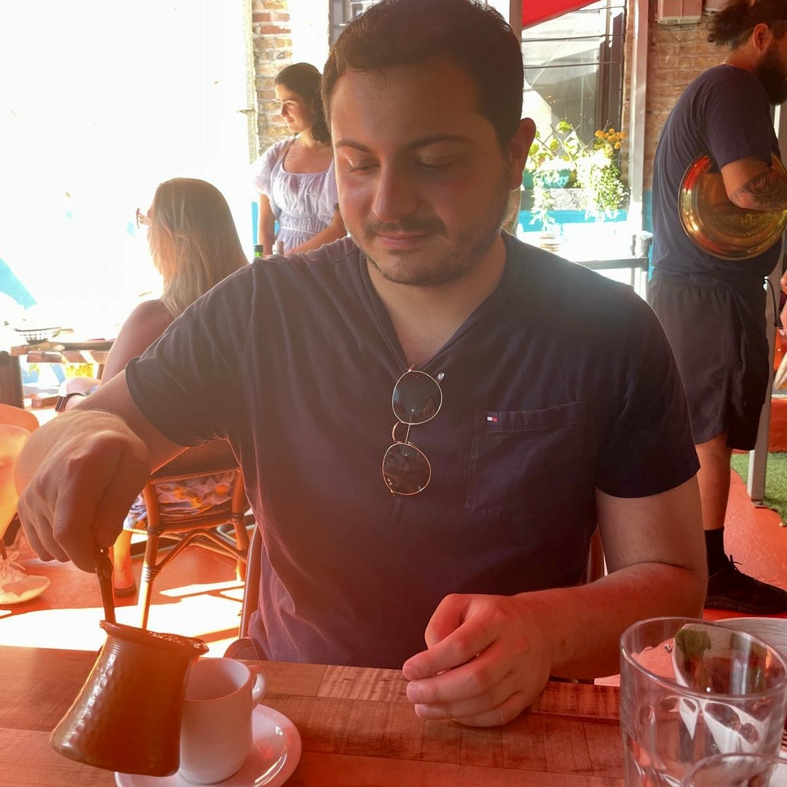

{:.profile}
{: style="object-fit: cover; border-radius: 50%; margin: 0 auto; max-width: 45%; width: 45%;"}

I am an Assitant Professor of Information Systems at [Arizona State University, W.P. Carey School of Business](https://wpcarey.asu.edu/). I work on the economics of networks, exploring their roles within large-scale social and information systems, and understanding their wider societal implications. I am also affiliated with [W. P. Carey's Center for AI and Data Analytics Center](https://aida.wpcarey.asu.edu/). 

I am interested in 

 * **LLMs for Social Science.** Exploring the capabilities of LLMs in social science, simulating human behavior, and simulating complex socio-technical systems. Recent examples include [network formation (PNAS Nexus, 2025)](https://arxiv.org/pdf/2402.10659.pdf) with LLM agents, and [collective decision-making (ACM CSCW, 2025)](https://arxiv.org/abs/2311.04928). 
 * **Information Diffusion and Contagion.** Exploring how information and contagion diffuses in networks and how to remediate it. Examples include  financial contagion ([paper1](https://dl.acm.org/doi/pdf/10.1145/3485447.3512047), [paper2](https://dl.acm.org/doi/10.1145/3543507.3583470), [paper3](https://papers.ssrn.com/sol3/papers.cfm?abstract_id=4880536)), and [supply chains](https://arxiv.org/abs/2303.12660).
 * **Privacy Preserving AI.** Exploring how agents learn in a distributed way subject to privacy considerations. Examples include learning with [continuous state spaces](https://www.tandfonline.com/doi/epdf/10.1080/24725854.2024.2337068?needAccess=true), and [discrete state spaces](https://arxiv.org/abs/2402.08156). 
 * **Network Models.** Exploring how (hyper)-graphs form. Examples include learning the structure of [core-periphery graphs](https://www.nature.com/articles/s41598-021-94105-8) and [hypergraphs](https://dl.acm.org/doi/abs/10.1145/3534678.3539272).

I hold a Ph.D. in Computer Science from Cornell University; where I had the fortune to be advised by  [Jon Kleinberg](http://www.cs.cornell.edu/home/kleinber/). My [thesis](https://drive.google.com/file/d/1hn-xa1mJ9SLPJdiCbQezk8VIp0cF_xKB/view?usp=sharing) focused on studying the resilience of sociotechnical systems. 

In the past, I have closely collaborated with the [Office of Applied Research](https://www.microsoft.com/en-us/research/group/office-of-applied-research/) at Microsoft Research, and the User Modeling Research Team at [Twitter Cortex (now X)](https://web.archive.org/web/20220802140832/https://cortex.twitter.com/), and have also contributed to the open-source statistical sampling software [volesti](https://github.com/GeomScale/volesti). 

My research has been supported by an [Onassis Scholarship](https://www.onassis.org/initiatives/scholarships), a [LinkedIn Ph.D. Fellowship](https://cis.cornell.edu/inaugural-grants-announced-strategic-partnership-linkedin), a grant from the [A.G. Leventis Foundation](https://www.leventisfoundation.org/), a grant from the Gerondelis Foundation, and a [Cornell University Fellowship](https://gradschool.cornell.edu/financial-support/fellowships/new-student-fellowships/).

* [[Google Scholar]](https://scholar.google.gr/citations?user=T12JO3MAAAAJ&hl=en) 
* [[GitHub]](https://github.com/papachristoumarios) 
* [[CV]](https://papachristoumarios.github.io/cv/cv.pdf) [[Twitter]](https://twitter.com/papachristoum)  
* [[LinkedIn]](https://www.linkedin.com/in/papachristoumarios)
* [[School Website]](https://search.asu.edu/profile/5338999)
