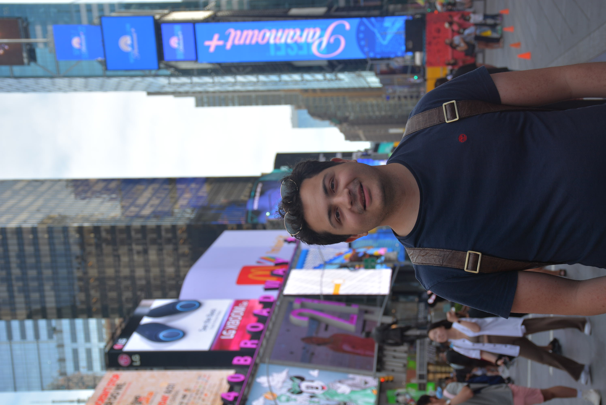

{:.profile}
{: style="float: left; width: 45%; margin: 25px"}

I am a third-year PhD candidate in the _Computer Science Department_ at _Cornell University_; extremely fortunate to be advised by Prof. [Jon Kleinberg](http://www.cs.cornell.edu/home/kleinber/). I am interested in the _theoretical_ and _applied_ aspects of _information networks_. More specifically, I work on problems regarding [statistical network models](https://www.nature.com/articles/s41598-021-94105-8), [hypergraphs](https://arxiv.org/abs/2206.00783), and [contagion](https://dl.acm.org/doi/abs/10.1145/3485447.3512047) problems. For the summer of 2022, I am interning at the User Modeling Research Team at [Twitter Cortex](https://cortex.twitter.com) whereas I work on scalable methods for node classification. I am also contributing to the open-source [GeomScale](https://geomscale.github.io) organization and the [volesti](https://github.com/GeomScale/volesti) package. My research is supported by a [LinkedIn Ph.D. Fellowship](https://cis.cornell.edu/inaugural-grants-announced-strategic-partnership-linkedin), a grant from the [A.G. Leventis Foundation](https://www.leventisfoundation.org/), and was supported in the past by a [Cornell University Fellowship](https://gradschool.cornell.edu/financial-support/fellowships/new-student-fellowships/).

I received my undergraduate degree from the School of Electrical and Computer Engineering at the National Technical University of Athens in July 2020 where I completed my thesis under the supervision of Prof. [Dimitris Fotakis](https://www.softlab.ntua.gr/~fotakis/). During my undergraduate studies, I have also been a researcher for the [Business Analytics Lab (BALab)](https://www.balab.aueb.gr), supervised by Prof. [Diomidis Spinellis](https://www2.dmst.aueb.gr/dds/) working on applications of machine learning on software architecture recovery.

[[google scholar]](https://scholar.google.gr/citations?user=T12JO3MAAAAJ&hl=en) [[github]](https://github.com/papachristoumarios) [[cv]](https://github.com/papachristoumarios/papachristoumarios.github.io/raw/master/cv/cv.pdf)

My personal pronouns are _he/him/his_.

## Papers

**Contact**

302 Gates Hall
Campus Rd,
Ithaca, NY 14853

e-mail: papachristoumarios (at] cs [dot) cornell (dot] edu
