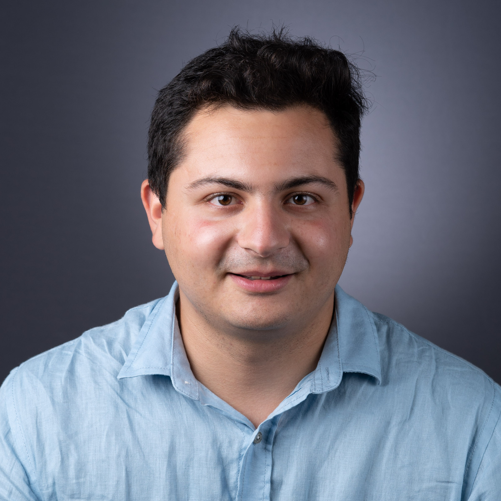

{:.profile}
{: style="float: left; width: 45%; margin: 25px"}

## Bio

I am a fourth-year Ph.D. candidate in the _Computer Science Department_ at _Cornell University_; extremely fortunate to be advised by Prof. [Jon Kleinberg](http://www.cs.cornell.edu/home/kleinber/).

My interests lie in algorithms and networks, exploring their roles within large-scale social and information systems, and understanding their wider societal implications. More specifically, I have worked on problems regarding statistical models of graphs and hypergraphs, financial contagion, and supply chain networks.

I currently intern at the [Office of Applied Research](https://www.microsoft.com/en-us/research/group/office-of-applied-research/) at Microsoft Research researching the use of large language models to enchance productivity and user experience. During my Ph.D., I interned at the User Modeling Research Team at [Twitter Cortex](https://cortex.twitter.com), where I worked on scalable methods for node classification. I have also contributed to the open-source [GeomScale](https://geomscale.github.io) organization and the [volesti](https://github.com/GeomScale/volesti) package. 

My research is supported by the [Onassis Scholarship](https://www.onassis.org/initiatives/scholarships), and has been supported in the past by a [LinkedIn Ph.D. Fellowship](https://cis.cornell.edu/inaugural-grants-announced-strategic-partnership-linkedin), a grant from the [A.G. Leventis Foundation](https://www.leventisfoundation.org/), a grant from the Gerondelis Foundation, and a [Cornell University Fellowship](https://gradschool.cornell.edu/financial-support/fellowships/new-student-fellowships/).

I earned my undergraduate degree from the [School of Electrical and Computer Engineering](https://www.ece.ntua.gr/en) at the National Technical University of Athens, where I completed my thesis at the [Computation And Reasoning Laboratory (CoReLab)](https://corelab.ntua.gr) under the supervision of Prof. [Dimitris Fotakis](https://www.softlab.ntua.gr/~fotakis/). I have also been a researcher for the [Business Analytics Lab (BALab)](https://www.balab.aueb.gr) at the [Department of Management Science and Technology](https://www.dept.aueb.gr/en/dmst) at the Athens University of Economics and Bussiness, supervised by Prof. [Diomidis Spinellis](https://www2.dmst.aueb.gr/dds/) working on applications of machine learning and networks on the topic of software architecture recovery.

[[Google Scholar]](https://scholar.google.gr/citations?user=T12JO3MAAAAJ&hl=en) [[GitHub]](https://github.com/papachristoumarios) [[CV]](https://papachristoumarios.github.io/cv/cv.pdf) [[Twitter]](https://twitter.com/papachristoum) <a rel="me noopener" href="https://mas.to/@papachristoum" target="_blank">[Mastodon]</a> [[LinkedIn]](https://www.linkedin.com/in/papachristoumarios)

My personal pronouns are _he/him/his_.

## Papers

**Contact**

324 Gates Hall
Campus Rd,
Ithaca, NY 14853

e-mail: papachristoumarios (at] cs [dot) cornell (dot] edu
