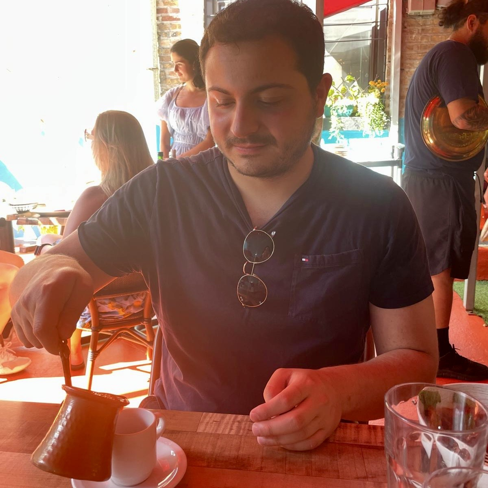

{:.profile}
{: style="object-fit: cover; border-radius: 50%; margin: 0 auto; max-width: 45%; width: 45%;"}

I am an Assitant Professor of Information Systems in the [W. P. Carey School of Business](https://wpcarey.asu.edu/) at Arizona State University. 

My research develops models of resilience in AI-enabled socio-technical systems, focusing on how network structure, algorithmic agents, and information dynamics jointly determine systemic resilience of socio-technical systems.

I am also affiliated with the [AI and Data Analytics Center](https://aida.wpcarey.asu.edu/). 

I hold a Ph.D. from Cornell University; where I had the fortune to be advised by  [Jon Kleinberg](http://www.cs.cornell.edu/home/kleinber/). My [thesis](https://papachristoumarios.github.io/theses/phd-thesis.pdf) can be found here.

My research focuses along three main streams:

 1.  **Algorithmic Agents and System Dynamics.**  I explore how do intelligent agents alter coordination, amplification, and systemic stability in digital environments. Recent examples include studying network dynamics ([PNAS Nexus 2025](
 https://doi.org/10.1093/pnasnexus/pgaf317), [Featured by TechXplore](https://techxplore.com/news/2025-12-llms-friends-colleagues-people.html), [Featured by SingularityHub](https://singularityhub.com/2025/12/09/study-ai-chatbots-choose-friends-just-like-humans-do/)) with LLM agents, and collective decision-making ([ACM CSCW 2025](https://arxiv.org/abs/2311.04928), [ACM Featured Article](https://www.growkudos.com/publications/10.1145%25252F3757418/reader)). 
 1. **Information Diffusion and Contagion.** I explore how information spreads and how cascades generate fragility, as well as how to remediate it. Examples include  financial contagion ([ACM WWW 2022](https://dl.acm.org/doi/pdf/10.1145/3485447.3512047), [ACM WWW 2023](https://dl.acm.org/doi/10.1145/3543507.3583470), [SSRN 2024](https://papers.ssrn.com/sol3/papers.cfm?abstract_id=4880536), [Federal Reserve Bank of Minneapolis Featured Article](https://www.minneapolisfed.org/article/2022/social-policy-in-the-age-of-algorithms-an-interview-with-jon-kleinberg), [TOC4Fairness](https://www.youtube.com/watch?v=gzPqQdo6vsU)), supply chains ([SSRN 2024](https://papers.ssrn.com/sol3/papers.cfm?abstract_id=4392226)), and social networks ([WWW 2026](https://arxiv.org/pdf/2502.15931)).
 2. **Trust, Privacy, and Governance in Data-Driven Systems.** I explore how can digital systems be designed to preserve trust and maintain stability under strategic and informational constraints. Examples include learning under information privacy ([IISE Transactions 2025](https://www.tandfonline.com/doi/epdf/10.1080/24725854.2024.2337068?needAccess=true), [ISE Magazine Featured Article](https://content.presspage.com/uploads/2602/19858d8c-d2d3-497e-9dcc-3f6eff36c157/ise-junefeature.pdf?10000), [Pitt News Article](https://news.engineering.pitt.edu/who-sees-who), [arXiV 2024](https://arxiv.org/abs/2402.08156)). 

In the past, I have closely collaborated with the [Office of Applied Research](https://www.microsoft.com/en-us/research/group/office-of-applied-research/) at Microsoft Research, and the User Modeling Research Team at [Twitter Cortex (now X)](https://web.archive.org/web/20220802140832/https://cortex.twitter.com/), and have also contributed to the open-source statistical sampling software [volesti](https://github.com/GeomScale/volesti). 

My research has been supported by an [Onassis Scholarship](https://www.onassis.org/initiatives/scholarships), a [LinkedIn Ph.D. Fellowship](https://cis.cornell.edu/inaugural-grants-announced-strategic-partnership-linkedin), a grant from the [A.G. Leventis Foundation](https://www.leventisfoundation.org/), a grant from the Gerondelis Foundation, and a [Cornell University Fellowship](https://gradschool.cornell.edu/financial-support/fellowships/new-student-fellowships/).

My CV can be found [here](https://papachristoumarios.github.io/cv/cv.pdf). 
