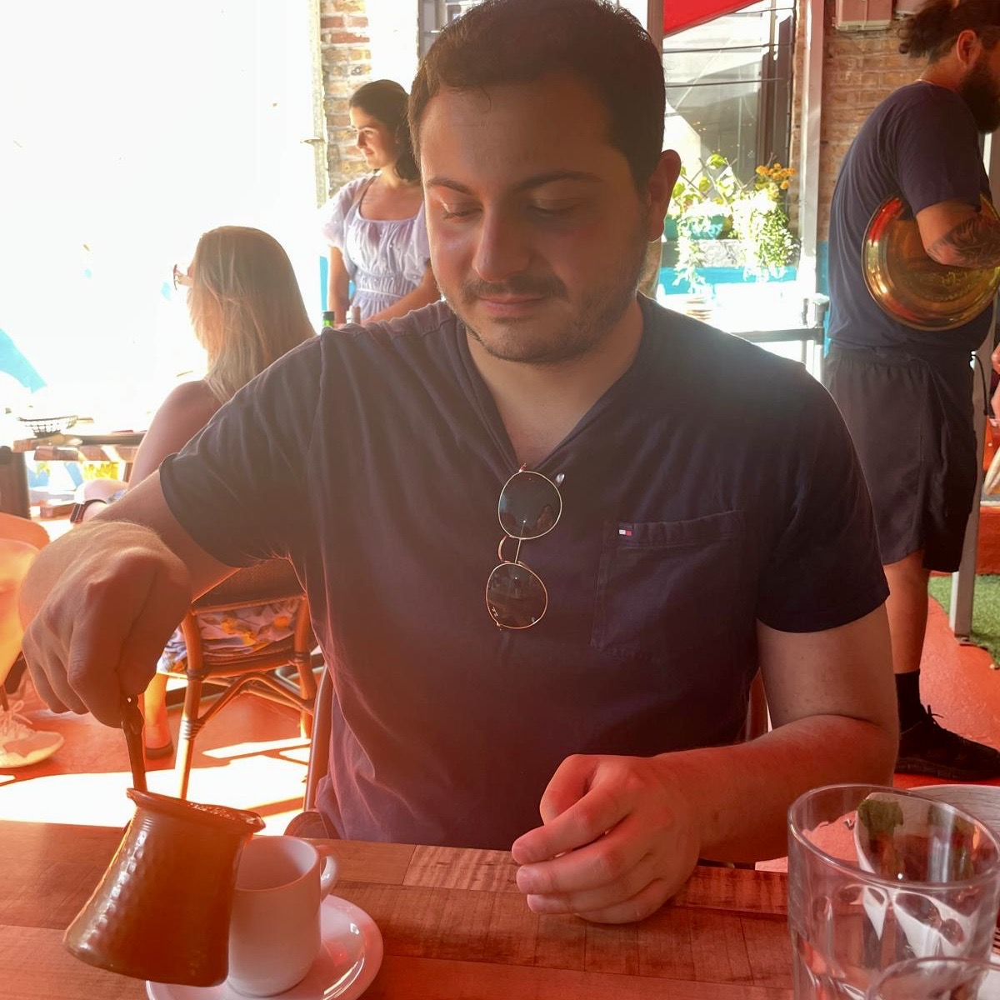

{:.profile}
{: style="object-fit: cover; border-radius: 50%; margin: 0 auto; max-width: 45%; width: 45%;"}

I am an Assistant Professor at the [W. P. Carey School of Business](https://wpcarey.asu.edu/) at Arizona State University. 

My research develops models for understanding and improving the )_resilience_ of modern socio-technical systems with downstream applications to platforms, supply chains, and organizations. I study the mechanisms causing fragility and devise analytical metrics to measure the resilience, prescriptive interventions, and decentralized decision-making under uncertainty and information constraints. 

I am also affiliated with the [AI and Data Analytics Center](https://aida.wpcarey.asu.edu/), and I am a graduate field member of [Data Science, Analytics and Engineering](https://dsae.engineering.asu.edu/), and [Computer Science](https://faculty.engineering.asu.edu/directory/scai/computer-science-and-engineering). 

I hold a Ph.D. from Cornell University; where I had the fortune to be advised by  [Jon Kleinberg](http://www.cs.cornell.edu/home/kleinber/). My [thesis](https://papachristoumarios.github.io/theses/phd-thesis.pdf) can be found here.

In the past, I have closely collaborated with the [Office of Applied Research](https://www.microsoft.com/en-us/research/group/office-of-applied-research/) at Microsoft Research, and the User Modeling Research Team at [Twitter Cortex (now X)](https://web.archive.org/web/20220802140832/https://cortex.twitter.com/), and have also contributed to the open-source statistical sampling software [volesti](https://github.com/GeomScale/volesti). 

My research has been supported by an [Director's Discretionary Award from the Argonne National Labs](https://www.alcf.anl.gov/science/directors-discretionary-allocation-program), [Onassis Scholarship](https://www.onassis.org/initiatives/scholarships), a [LinkedIn Ph.D. Fellowship](https://cis.cornell.edu/inaugural-grants-announced-strategic-partnership-linkedin), a grant from the [A.G. Leventis Foundation](https://www.leventisfoundation.org/), a grant from the Gerondelis Foundation, and a [Cornell University Fellowship](https://gradschool.cornell.edu/financial-support/fellowships/new-student-fellowships/).

My CV can be found [here](https://papachristoumarios.github.io/cv/cv.pdf). 
