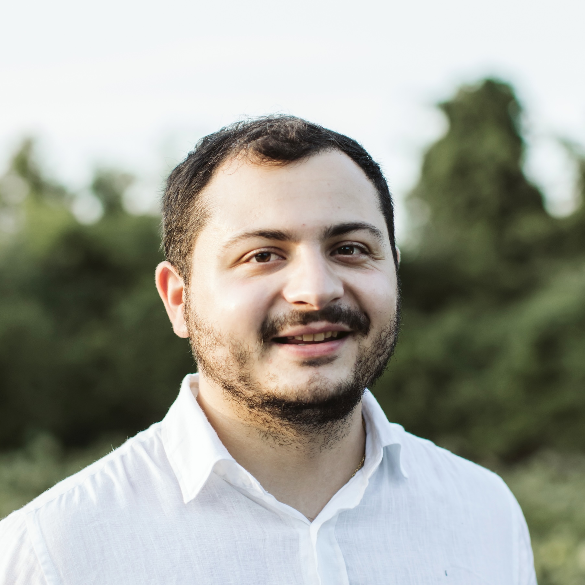

{:.profile}
{: style="float: left; width: 45%; margin: 25px"}

**I am on the 2024-2025 academic job market looking for academic positions or research industry positions.**

I am a rising fifth-year Ph.D. candidate in the _Computer Science Department_ at _Cornell University_; extremely fortunate to be advised by Prof. [Jon Kleinberg](http://www.cs.cornell.edu/home/kleinber/).

I work on algorithms and networks, exploring their roles within large-scale social and information systems, and understanding their wider societal implications. I am also affiliated with [Cornell's Artificial Intelligence, Policy, and Practice (AIPP)](https://aipp.cis.cornell.edu/) initiative. 

I am interested in 

 * **Information Diffusion and Contagion.** Exploring how information and contagion diffuses in networks and how to remediate it. Examples include  financial contagion ([paper1](https://dl.acm.org/doi/pdf/10.1145/3485447.3512047), [paper2](https://dl.acm.org/doi/10.1145/3543507.3583470), [paper3](https://papers.ssrn.com/sol3/papers.cfm?abstract_id=4880536)), and [supply chains](https://arxiv.org/abs/2303.12660).
 * **Privacy Preserving AI.** Exploring how agents learn in a distributed way subject to privacy considerations. Examples include learning with [continuous state spaces](https://www.tandfonline.com/doi/epdf/10.1080/24725854.2024.2337068?needAccess=true), and [discrete state spaces](https://arxiv.org/abs/2402.08156). 
 * **Network Models.** Exploring how (hyper)-graphs form. Examples include learning the structure of [core-periphery graphs](https://www.nature.com/articles/s41598-021-94105-8) and [hypergraphs](https://dl.acm.org/doi/abs/10.1145/3534678.3539272).
 * **LLMs for Social Science.** Exploring the capabilities of LLMs in social science, simulating human behavior, and simulating complex socio-technical systems. Recent examples include [network formation](https://arxiv.org/pdf/2402.10659.pdf) with LLM agents, and [collective decision-making](https://arxiv.org/abs/2311.04928). 

During my Ph.D., I have interned at the [Office of Applied Research](https://www.microsoft.com/en-us/research/group/office-of-applied-research/) at Microsoft researching the use of LLMs in collective decision-making, and the User Modeling Research Team at [Twitter Cortex](https://web.archive.org/web/20220802140832/https://cortex.twitter.com/), where I worked on scalable methods for node classification. I have also contributed to the open-source [volesti](https://github.com/GeomScale/volesti) package. 

My research has been supported by an [Onassis Scholarship](https://www.onassis.org/initiatives/scholarships), a [LinkedIn Ph.D. Fellowship](https://cis.cornell.edu/inaugural-grants-announced-strategic-partnership-linkedin), a grant from the [A.G. Leventis Foundation](https://www.leventisfoundation.org/), a grant from the Gerondelis Foundation, and a [Cornell University Fellowship](https://gradschool.cornell.edu/financial-support/fellowships/new-student-fellowships/).

I earned my undergraduate degree from the [School of Electrical and Computer Engineering](https://www.ece.ntua.gr/en) at the National Technical University of Athens, where I completed my thesis at the [Computation And Reasoning Laboratory (CoReLab)](https://corelab.ntua.gr) under the supervision of Prof. [Dimitris Fotakis](https://www.softlab.ntua.gr/~fotakis/). I have also been a researcher for the [Business Analytics Lab (BALab)](https://www.balab.aueb.gr) at the [Department of Management Science and Technology](https://www.dept.aueb.gr/en/dmst) at the Athens University of Economics and Bussiness, advised by Prof. [Diomidis Spinellis](https://www2.dmst.aueb.gr/dds/).

[[Google Scholar]](https://scholar.google.gr/citations?user=T12JO3MAAAAJ&hl=en) [[GitHub]](https://github.com/papachristoumarios) [[CV]](https://papachristoumarios.github.io/cv/cv.pdf) [[Twitter]](https://twitter.com/papachristoum) <a rel="me noopener" href="https://mas.to/@papachristoum" target="_blank">[Mastodon]</a> [[LinkedIn]](https://www.linkedin.com/in/papachristoumarios)

My personal pronouns are _he/him/his_.

## Contact

Office: 302 Gates Hall, Campus Rd, Ithaca, NY 14853

e-mail: papachristoumarios (at] cs [dot) cornell (dot] edu

## Papers

